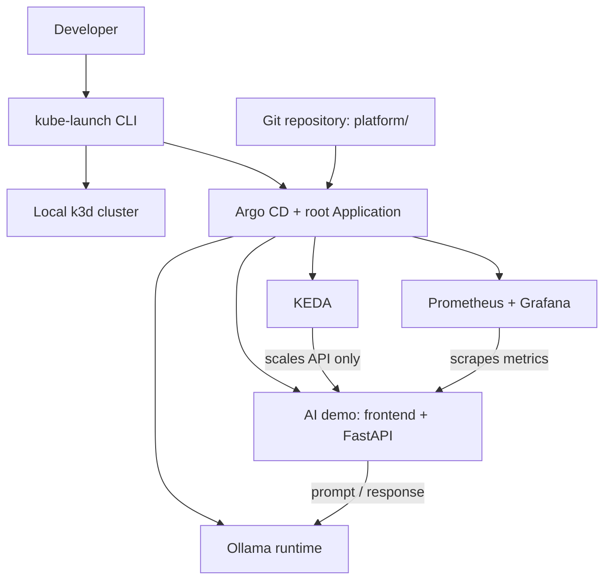

# KubeLaunch

KubeLaunch is a GitOps-native Kubernetes platform bootstrapper for AI-ready
workloads. One command will create a local Kubernetes platform running a small
AI demo, observability, and autoscaling.

> **Project status:** early scaffolding. No cluster or platform components are
> installed yet.

## Why KubeLaunch?

Running an AI workload locally is easy to demonstrate in isolation. Running it
as a small, understandable platform—with declarative delivery, useful metrics,
and workload-aware scaling—is harder. KubeLaunch is intended to make that path
reproducible without hiding the Kubernetes and GitOps concepts it demonstrates.

## MVP goals

- Create a local Kubernetes cluster with k3d.
- Bootstrap Argo CD and one root Application from a small CLI.
- Let Argo CD manage the rest of the platform through app-of-apps.
- Run a CPU-friendly Ollama model as one stable AI runtime.
- Provide a simple prompt UI backed by FastAPI.
- Observe the platform with Prometheus and Grafana.
- Autoscale the API workload with KEDA (not the Ollama runtime).
- Keep the complete local demo understandable and easy to tear down.

## Not in the MVP

- cert-manager or automated TLS
- External Secrets or Vault integration
- an `AIWorkload` CRD/operator
- vLLM and alternative inference runtimes
- canary model rollouts
- cloud deployment automation

These are candidates for a future `--full` mode or a post-MVP release. See the
[roadmap](docs/README.md#roadmap).

## Architecture



The CLI has a deliberately narrow responsibility: create the local cluster,
bootstrap Argo CD, and apply one root Argo CD Application. Platform components
are reconciled from Git by Argo CD rather than installed imperatively by the
CLI.

## Planned quickstart

The commands below describe the intended interface; they are not implemented
yet.

```console
kube-launch up --minimal
kube-launch status
kube-launch down
```

Until the CLI exists, run `make help` to see the current project tasks. Tasks
that belong to later milestones exit with a clear placeholder message.

## Repository layout

```text
.
|-- cli/                   # Python/Typer kube-launch CLI (Milestone 1+)
|-- platform/              # Root app and GitOps-managed platform definitions
|   `-- components/        # Argo CD Applications for platform components
|-- apps/
|   `-- ai-demo/           # Demo frontend, backend, and deployment definitions
|-- docs/                  # Architecture, demo notes, and roadmap
|-- scripts/               # Small local development helpers, when needed
|-- .github/workflows/     # CI workflows (Milestone 12)
`-- Makefile               # Stable developer entry points
```

Python with [Typer](https://typer.tiangolo.com/) is the planned CLI stack. It
keeps the bootstrap code compact and testable while leaving all ongoing
platform reconciliation to Argo CD.

## Development

```console
make help
make test
make lint
make validate
```

The test, lint, and validation tasks are intentionally no-ops until their
respective project code is introduced. They provide stable entry points for
future milestones without pretending that checks already exist.

## License

No license has been selected yet.
