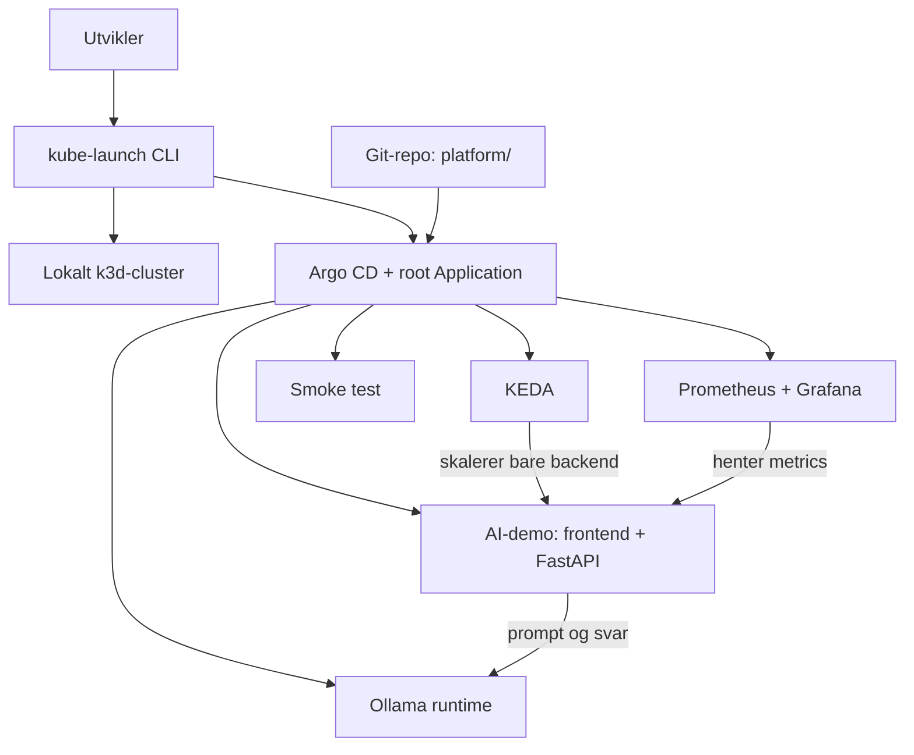

# KubeLaunch

KubeLaunch setter opp en lokal Kubernetes-plattform for en liten AI-demo. Målet
er å vise hvordan k3d, Argo CD, Prometheus, Grafana, KEDA og Ollama kan fungere
sammen, uten at prosjektet blir unødvendig stort.

> **Status:** CLI-et kan opprette et lokalt k3d-cluster og installere Argo CD.
> App-of-apps-flyten, Prometheus og Grafana er koblet opp. De øvrige
> plattformkomponentene kommer i senere milepæler.

## Hvorfor dette prosjektet?

Det er ganske enkelt å kjøre en AI-modell lokalt. Det blir fort mer uoversiktlig
når modellen også skal pakkes inn i en applikasjon, overvåkes og skaleres i
Kubernetes. KubeLaunch samler disse delene i et lite prosjekt hvor oppsettet er
synlig og mulig å forstå.

CLI-et skal bare gjøre det som trengs for å komme i gang: opprette et lokalt
cluster, installere Argo CD og legge inn én root Application. Etter det tar Argo
CD over. Resten av plattformen skal altså ligge i Git, ikke i et langt script
med `helm install`-kommandoer.

## Dette skal være med i første versjon

- lokalt Kubernetes-cluster med k3d
- Argo CD med app-of-apps
- en liten Ollama-modell som kjører på CPU
- enkel frontend og FastAPI-backend for å sende inn en prompt
- metrics i Prometheus og Grafana
- autoskalering av backend med KEDA
- kommandoer for å starte, sjekke og rydde bort miljøet

KEDA skal skalere backend, ikke Ollama. Ollama skal være én stabil runtime slik
at modellen slipper å starte på nytt hver gang trafikken endrer seg.

## Dette venter til senere

- cert-manager og automatisk TLS
- External Secrets og Vault-integrasjon
- `AIWorkload` CRD og operator
- vLLM som alternativ runtime
- canary-utrulling av modeller
- automatisk oppsett i skyen

Se [videre plan](docs/README.md#videre-plan) for rekkefølgen på milepælene.

## Arkitektur



## Kom i gang med CLI-et

Lag gjerne et eget Python-miljø før du installerer prosjektet:

```console
python -m venv .venv
# Aktiver .venv med kommandoen som passer skallet ditt
python -m pip install -e ".[dev]"
```

Kommandoene sjekker først om nødvendige verktøy finnes. `up` oppretter clusteret
bare hvis det mangler, installerer eller oppdaterer Argo CD og legger inn root
Application. `down` ber om bekreftelse før hele clusteret slettes.

```console
kube-launch up --minimal
kube-launch status
kube-launch down
kube-launch down --yes  # hopper over bekreftelsen
```

Kjør `make help` for å se de samme oppgavene via Makefile.

## Mappestruktur

```text
.
|-- cli/                   # CLI skrevet med Python og Typer
|-- platform/              # Root app og GitOps-oppsett
|   `-- components/        # Argo CD Applications for hver komponent
|-- apps/
|   |-- ai-demo/           # Frontend, backend og Kubernetes-oppsett
|   `-- platform-smoke-test/ # Enkel test av GitOps-flyten
|-- docs/                  # Arkitektur, demo-notater og videre plan
|-- scripts/               # Små hjelpere for lokal testing
|-- .github/workflows/     # CI kommer i milepæl 12
`-- Makefile               # Faste kommandoer for utvikling
```

CLI-et skrives i Python med [Typer](https://typer.tiangolo.com/). Det holder
bootstrap-koden liten og enkel å teste, mens Argo CD får ansvaret for den
løpende synkroniseringen av plattformen.

## Slik går endringer fra Git til clusteret

1. `kube-launch up --minimal` legger inn `platform/root-application.yaml`.
2. Root Application leser Application-filene under `platform/components/`.
3. Hver child Application peker videre på sin egen mappe under `apps/`.
4. Argo CD renderer Kustomize-filene og synkroniserer dem til clusteret.

Den første child Application er `platform-smoke-test`. Den kjører én liten
nginx-pod i `kubelaunch-system` og gjør det mulig å bekrefte hele GitOps-flyten
før Prometheus, KEDA og Ollama legges til.

Etter at endringene er pushet og Argo CD har synkronisert, kan testen sjekkes
slik:

```console
kubectl --context k3d-kubelaunch -n kubelaunch-system get deployment,service
```

## Prometheus og Grafana

Observability installeres av Argo CD med `kube-prometheus-stack`. Oppsettet er
tilpasset et lite k3d-cluster: Alertmanager er slått av, data lagres midlertidig
og Prometheus beholder metrics i seks timer. De innebygde Kubernetes-dashboardene
er tilgjengelige med en gang Grafana er klar.

Start lokal tilgang til Grafana:

```console
make grafana
# eller:
kubectl --context k3d-kubelaunch --namespace monitoring port-forward service/kubelaunch-grafana 3000:80
```

Åpne `http://localhost:3000` og logg inn som `admin`. Det genererte passordet
kan hentes uten ekstra verktøy:

```console
kubectl --context k3d-kubelaunch --namespace monitoring get secret kubelaunch-grafana --output go-template='{{index .data "admin-password" | base64decode}}{{"\n"}}'
```

`kube-launch status` viser både sync-status og port-forward-kommandoen.

## Utvikling

```console
make help
make test
make lint
make validate
```

`test` og `lint` kjører kontrollene for CLI-et. `validate` er foreløpig en
placeholder og tas i bruk når de første plattformfilene kommer.

## Lisens

Prosjektet har ikke fått en lisens ennå.
