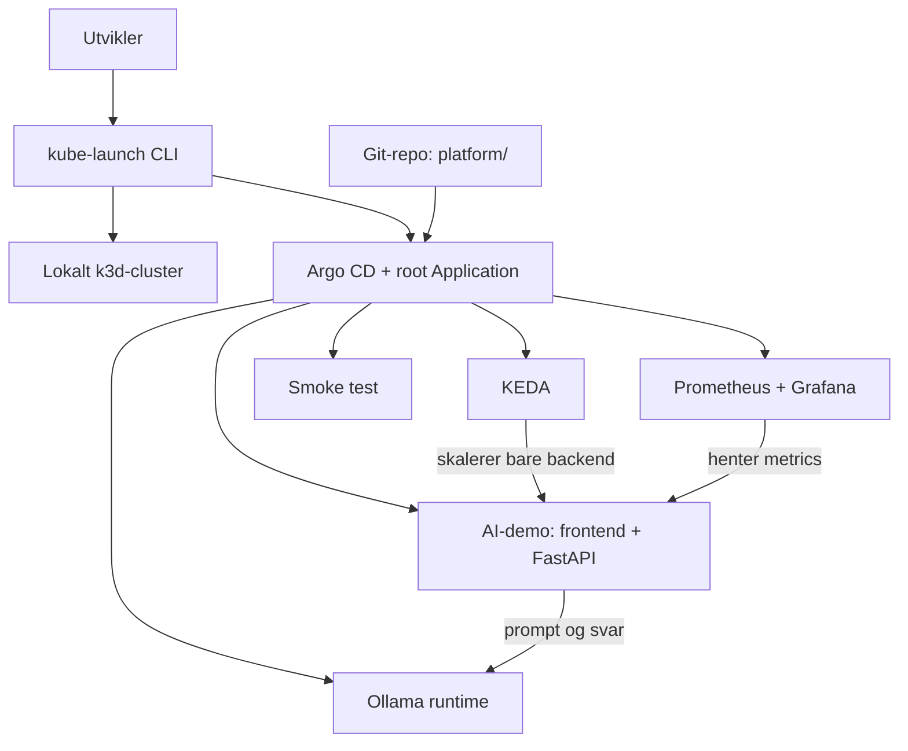

# KubeLaunch

[](https://github.com/ViktorKnu/KubeLaunch/actions/workflows/ci.yml)

KubeLaunch setter opp en lokal Kubernetes-plattform for en liten AI-demo. Målet
er å vise hvordan k3d, Argo CD, Prometheus, Grafana, KEDA og Ollama kan fungere
sammen, uten at prosjektet blir unødvendig stort.

> **Status:** CLI-et kan opprette et lokalt k3d-cluster og installere Argo CD.
> App-of-apps, observability, KEDA, Ollama, FastAPI-backenden og frontenden er
> koblet opp. Backenden autoskaleres med KEDA basert på aktive prompts.

## Hvorfor dette prosjektet?

Det er ganske enkelt å kjøre en AI-modell lokalt. Det blir fort mer uoversiktlig
når modellen også skal pakkes inn i en applikasjon, overvåkes og skaleres i
Kubernetes. KubeLaunch samler disse delene i et lite prosjekt hvor oppsettet er
synlig og mulig å forstå.

CLI-et skal bare gjøre det som trengs for å komme i gang: opprette et lokalt
cluster, installere Argo CD og legge inn én root Application. Etter det tar Argo
CD over. Resten av plattformen skal altså ligge i Git, ikke i et langt script
med `helm install`-kommandoer.

## Dette skal være med i første versjon

- lokalt Kubernetes-cluster med k3d
- Argo CD med app-of-apps
- en liten Ollama-modell som kjører på CPU
- enkel frontend og FastAPI-backend for å sende inn en prompt
- metrics i Prometheus og Grafana
- autoskalering av backend med KEDA
- kommandoer for å starte, sjekke og rydde bort miljøet

KEDA skal skalere backend, ikke Ollama. Ollama skal være én stabil runtime slik
at modellen slipper å starte på nytt hver gang trafikken endrer seg.

## Dette venter til senere

- automatisk TLS for frontenden med en offentlig issuer
- `AIWorkload` CRD og operator
- vLLM som alternativ runtime
- canary-utrulling av modeller
- automatisk oppsett i skyen

Se [videre plan](docs/README.md#videre-plan) for rekkefølgen på milepælene.

## Arkitektur



## Kom i gang med CLI-et

Lag gjerne et eget Python-miljø før du installerer prosjektet:

```console
python -m venv .venv
# Aktiver .venv med kommandoen som passer skallet ditt
python -m pip install -e ".[dev]"
```

Kommandoene sjekker først om nødvendige verktøy finnes. `up` oppretter clusteret
bare hvis det mangler, installerer eller oppdaterer Argo CD og legger inn root
Application. `down` ber om bekreftelse før hele clusteret slettes.

Kubernetes API-et bindes til `127.0.0.1`. CLI-et venter i opptil to minutter på
at API-et blir klart før bootstrapen fortsetter.

`--minimal` kjører MVP-plattformen. `--full` bruker den samme plattformen og
legger til cert-manager, External Secrets Operator og en lokal Vault-demo.
Profilene er gjensidig eksklusive, og den aktive profilen vises av
`kube-launch status`.

```console
kube-launch up --minimal
kube-launch up --full     # utvidet profil med cert-manager
kube-launch status
kube-launch down
kube-launch down --yes  # hopper over bekreftelsen
```

Kjør `make help` for å se de samme oppgavene via Makefile.

## Mappestruktur

```text
.
|-- cli/                   # CLI skrevet med Python og Typer
|-- platform/              # Root app og GitOps-oppsett
|   `-- components/        # Argo CD Applications for hver komponent
|-- apps/
|   |-- ai-demo/           # Webfrontend og FastAPI-backend
|   |-- keda-smoke-test/   # Isolert test av autoskalering
|   |-- ollama/            # Stabil lokal AI-runtime og modellager
|   `-- platform-smoke-test/ # Enkel test av GitOps-flyten
|-- docs/                  # Arkitektur, demo-notater og videre plan
|-- scripts/               # Små hjelpere for lokal testing
|-- .github/workflows/     # CI kommer i milepæl 12
`-- Makefile               # Faste kommandoer for utvikling
```

CLI-et skrives i Python med [Typer](https://typer.tiangolo.com/). Det holder
bootstrap-koden liten og enkel å teste, mens Argo CD får ansvaret for den
løpende synkroniseringen av plattformen.

## Slik går endringer fra Git til clusteret

1. `kube-launch up --minimal` legger inn `platform/root-application.yaml`.
2. Root Application leser Application-filene under `platform/components/`.
3. Hver child Application peker videre på sin egen mappe under `apps/`.
4. Argo CD renderer Kustomize-filene og synkroniserer dem til clusteret.

Fullprofilen bruker `profiles/full/root-application.yaml`, som kombinerer de
samme felleskomponentene med profilspesifikke Applications.

## Fullprofil og cert-manager

Aktiver fullprofilen:

```console
kube-launch up --full
```

cert-manager installeres fra et pinnet Helm-chart med CRD-ene aktivert. En
selvsignert `ClusterIssuer` oppretter et testsertifikat for `kubelaunch.local`.
Kontroller resultatet med:

```console
make cert-status
# eller:
kubectl --context k3d-kubelaunch --namespace kubelaunch-system get certificate,secret
```

Bytt tilbake med `kube-launch up --minimal`. Argo CD fjerner da komponentene som
bare tilhører fullprofilen.

## External Secrets og lokal Vault

Fullprofilen kjører Vault i dev-modus og bruker en kjent lokal demo-token. En
PostSync-jobb skriver en testverdi til Vault KV v2, og External Secrets Operator
synkroniserer verdien til Kubernetes Secret `kubelaunch-vault-demo`.

> Vault-oppsettet er usikkert, lagrer data i minnet og er kun ment for lokal
> læring og demonstrasjon. Det må aldri brukes i produksjon.

Kontroller hele secret-flyten:

```console
make secret-status
# eller:
kubectl --context k3d-kubelaunch --namespace kubelaunch-system get secretstore,externalsecret,secret
```

Åpne Vault lokalt med `make vault`, gå til `http://localhost:8200` og bruk
tokenen `kubelaunch-dev-only`.

Den første child Application er `platform-smoke-test`. Den kjører én liten
nginx-pod i `kubelaunch-system` og gjør det mulig å bekrefte hele GitOps-flyten
før Prometheus, KEDA og Ollama legges til.

Etter at endringene er pushet og Argo CD har synkronisert, kan testen sjekkes
slik:

```console
kubectl --context k3d-kubelaunch -n kubelaunch-system get deployment,service
```

## Prometheus og Grafana

Observability installeres av Argo CD med `kube-prometheus-stack`. Oppsettet er
tilpasset et lite k3d-cluster: Alertmanager er slått av, data lagres midlertidig
og Prometheus beholder metrics i seks timer. De innebygde Kubernetes-dashboardene
er tilgjengelige med en gang Grafana er klar.

Start lokal tilgang til Grafana:

```console
make grafana
# eller:
kubectl --context k3d-kubelaunch --namespace monitoring port-forward service/kubelaunch-grafana 3000:80
```

Åpne `http://localhost:3000` og logg inn som `admin`. Det genererte passordet
kan hentes uten ekstra verktøy:

```console
kubectl --context k3d-kubelaunch --namespace monitoring get secret kubelaunch-grafana --output go-template='{{index .data "admin-password" | base64decode}}{{"\n"}}'
```

`kube-launch status` viser sync og health for alle plattformapplikasjonene,
sammen med port-forward-kommandoer for frontenden, Grafana og Ollama.

## Test KEDA-skalering

KEDA installeres fra det offisielle Helm-chartet. En egen smoke test bruker
CPU-scaleren mot Kubernetes sitt `hpa-example`, slik at autoskalering kan testes
før AI-backenden finnes. KEDA oppretter en HPA som holder mellom én og tre pods.

Start last i én terminal:

```console
make keda-load
```

Følg skaleringen i en annen terminal:

```console
make keda-status
# eller kontinuerlig:
kubectl --context k3d-kubelaunch --namespace kubelaunch-system get deployment,hpa --watch
```

Etter en liten stund skal antall replikaer øke. Stopp lastgeneratoren med
`Ctrl+C`; workloaden skal gå tilbake til én replika etter stabiliseringsvinduet.
Denne testen skalerer bare dummy-appen. Ollama skal senere kjøre stabilt med én
replika.

## Test Ollama direkte

Ollama kjører med én replika og blir ikke skalert av KEDA. Modellen
`tinyllama` er liten nok til en lokal CPU-demo og lagres på en 3 GiB PVC, slik
at en omstart av podden ikke utløser en ny nedlasting.

Start port-forward i én terminal:

```console
make ollama
# eller:
kubectl --context k3d-kubelaunch --namespace ollama port-forward service/ollama 11434:11434
```

Kontroller først at modellen finnes:

```console
curl.exe http://localhost:11434/api/tags
```

Send deretter en kort prompt direkte til Ollama:

```console
curl.exe http://localhost:11434/api/generate -H "Content-Type: application/json" -d '{"model":"tinyllama","prompt":"Svar med én kort setning: Hva er Kubernetes?","stream":false}'
```

Første svar kan ta litt tid på CPU. Hvis `tinyllama` ikke vises i `/api/tags`,
sjekk PostSync-jobben og Argo CD-syncen før du tester videre.

## Test backenden

FastAPI-backenden validerer prompten, kaller Ollama og returnerer svar, modellnavn
og responstid. Den eksponerer også Prometheus-metrics for antall prompts og
responstid.

Bygg imagen og importer den til k3d før Argo CD deployer appen:

```console
make backend-image
```

Etter at endringen er committet, pushet og `ai-demo-backend` er `Healthy`, start
port-forward:

```console
make backend
```

Test health, prompt og metrics fra en annen terminal:

```console
curl.exe http://localhost:8000/health
curl.exe http://localhost:8000/api/prompt -H "Content-Type: application/json" -d '{"prompt":"Hva er GitOps? Svar kort."}'
curl.exe http://localhost:8000/metrics
```

Prometheus finner `/metrics` gjennom en ServiceMonitor. KEDA leser antall aktive
prompts fra Prometheus og skalerer backenden mellom én og tre replikaer. Ollama
forblir én stabil replika.

### Test autoskalering av backenden

Start frontenden med `make frontend`, og send flere prompts samtidig fra ulike
nettleserfaner. Følg skaleringen i en annen terminal:

```console
make backend-scale-status
# eller kontinuerlig:
kubectl --context k3d-kubelaunch --namespace ai-demo get scaledobject,hpa,deployment --watch
```

KEDA sikter mot én aktiv prompt per backend-replika og kan skalere opp til tre.
Etter 60 sekunder uten belastning skaleres backenden gradvis ned til én replika.

## Test frontenden

Frontenden er statisk HTML, CSS og JavaScript servert av nginx. Nginx sender
`/api/` videre til backenden internt i clusteret, slik at samme oppsett fungerer
uten CORS-regler i FastAPI.

Bygg imagen og importer den til k3d:

```console
make frontend-image
```

Etter at `ai-demo-frontend` er `Healthy`, start port-forward:

```console
make frontend
```

Åpne `http://localhost:8080`, skriv en prompt og kontroller at svar, modellnavn
og responstid vises.

## Utvikling

```console
make help
make test
make lint
make validate
```

`test` og `lint` kjører kontrollene for CLI-et. `validate` sjekker YAML-filene
og renderer Kustomize-appene lokalt.

## Kontinuerlig integrasjon

GitHub Actions kjører automatisk ved push til `main` og for pull requests. CI
tester prosjektet med Python 3.11 og 3.13, kjører Ruff, validerer alle
Kubernetes-manifester, renderer Kustomize-applikasjonene og bygger backend- og
frontend-imagene. Workflowen har bare lesetilgang til repository-innholdet.

## Lisens

Prosjektet har ikke fått en lisens ennå.
